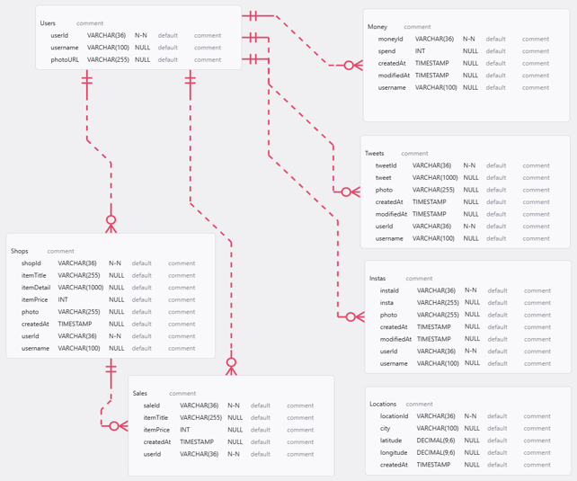
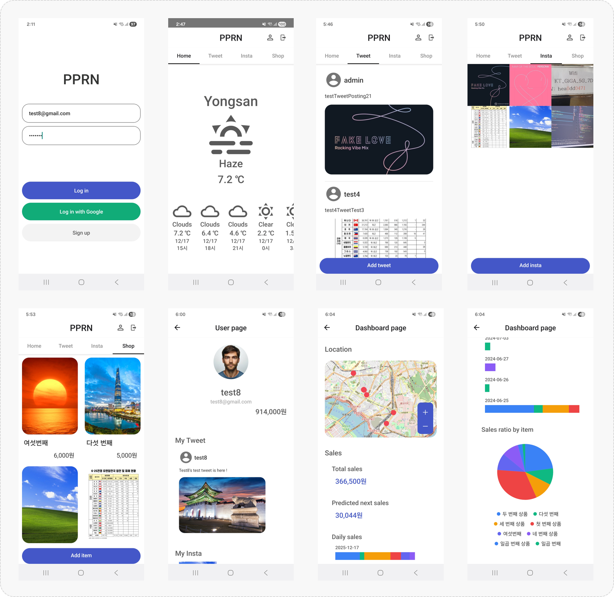

# 📱 PPRN (Portfolio Project with React Native & Firebase)

---

## 📌 Overview

### Problem & Needs (문제 및 니즈)

- Need for a Super App : Integration of user services and enterprise data capabilities into a single platform.  
  (SNS·쇼핑 등 유저 기능과 데이터 관리·분석 등 기업 기능을 통합한 슈퍼앱 플랫폼의 필요)

### Solution & Impact (솔루션 및 기대효과)

- A Super App Integrating User and Enterprise Functions : A versatile, multi-functional platform designed for scalable future service expansion.  
  (유저 기능과 기업 기능을 통합한 슈퍼앱 : 향후 서비스 확장도 가능한 다기능 범용 플랫폼)

---

## 👤 Role & Responsibilities

### Full-stack IT Service Planner & Developer (풀스택 IT 서비스 기획자 & 개발자)

- Responsible for end-to-end planning, system architecture design, database modeling, frontend and backend development, cloud infrastructure integration, and data analysis feature implementation.  
  (프로젝트 전체 기획부터 시스템 아키텍처 설계, ERD 설계, 프론트엔드·백엔드 개발, AWS 클라우드 연동 및 데이터 분석 기능 통합까지 End-to-End로 담당)

---

## ⚙️ Tech Stack

- OS : Windows 11

- IDE : Visual Studio Code, Android Studio

- Target Platform : Android (Samsung Galaxy S22)

- Framework : React Native (0.74.0)

- Languages : JavaScript (ES6+), Java (17.0.11)

- Runtime / Build : Node.js (20.12.2), npm (10.8.1)

- Backend (Firebase) : Authentication, Firestore Database, Storage

- Version Control : Git, GitHub

- Others : Figma, Photoshop, Canva

---

## 🔍 Rationale for Key Technology & Feature Choices

### React Native

- Single codebase for Android & iOS enables reduced development and operational costs, and faster updates.  
  (단일 코드베이스로 Android·iOS 동시 대응으로 개발·운영 비용 최소화 및 업데이트 속도 향상)

### Firebase Authentication

- Enables quick and secure user authentication without the need for a separate authentication server.  
  (회원가입·로그인 기능을 빠르고 안정적으로 구현하고, 별도 인증 서버 운영 없이 관리 부담을 최소화 가능)

### Firebase Firestore DB

- Real-time, scalable NoSQL database optimized for mobile applications.  
  (모바일 서비스 특성에 맞춰 실시간 처리와 확장성이 뛰어난 NoSQL 기반 Firestore 데이터 저장소로 활용)

### Firebase Storage

- Relational DB chosen for reliable management of structured user, content, and product data.  
  (빠른 개발과 자동화를 통해 비용과 대기시간을 최소화하고, 향후 머신러닝 분석 확장이 가능한 구조로 적용)

### Signup / Login

- Structured user authentication and session management establish a robust service framework.  
  (유저 인증 및 세션 관리 기능을 통한 체계화된 서비스 기반 구조 확립)

### Weather

- Location-based information enhances user engagement and return rate.  
  (위치 기반 정보 제공을 통한 사용자 체류 시간 및 재방문율 향상)

### Tweet / Insta

- Implements content-driven service interactions including posts, feeds, and image uploads for major SNS.  
  (업계 주요 SNS들의 게시·피드·이미지 업로드 등 콘텐츠 기반 서비스 인터랙션 구조를 구현)

### Shop

- End-to-end e-commerce flow : product registration, modification, deletion, and purchase.  
  (상품 등록·수정·삭제·구매 등 e커머스 엔드투엔드 흐름 구현)

### User Info

- Provides RUD for user profiles and activity data, enhancing service experience and overall completeness.  
  (사용자 프로필 및 활동 데이터 RUD 기능 제공으로 서비스 경험을 강화하고 서비스 완성도를 높이기 위해 적용)

### Dashboard

- Aggregates and visualizes overall user data on a single screen to derive actionable insights.  
  (사용자 위치 데이터와 매출 데이터를 단일 화면에서 분석하고 인사이트 도출을 위한 시각화 구현)

---

## 🧱 System Architecture

- The system is built on a serverless Firebase architecture. A React Native-based mobile client communicates with backend services through Firebase. Data is stored in Firestore DB and Storage, and revenue analysis is performed.  
  (React Native 모바일 앱을 클라이언트로 하여 Firebase 기반의 서버리스 백엔드를 구성하였으며, Firestore DB와 Storage를 통해 데이터를 관리하고 매출 분석 처리를 수행하는 구조)

---

## 🗂 Database (ERD)

- Although currently implemented using a Firebase Firestore DB (NoSQL), the relational database schema was designed to support user management, social content, e-commerce transactions, and analytics data, ensuring scalability and data integrity across multiple service domains.  
  (현재는 NoSQL 방식의 Firebase Firestore DB로 구현되어 있으나, 유저 관리, SNS 콘텐츠, 쇼핑 트랜잭션, 분석 데이터를 통합적으로 관리할 수 있도록 관계형 데이터베이스 구조와 유사하게 설계하여 확장성과 데이터 정합성을 확보)

---

## 🖥 Main Features

### Signup / Login

- User registration, authentication, and session management  
  (회원가입, 로그인 및 세션 관리 기능)

### Weather

- Location-based weather forecasting functionality  
  (위치 기반 일기 예보 기능)

### Tweet

- Twitter style SNS with full CRUD operations  
  (트위터 스타일 SNS의 CRUD 기능)

### Insta

- Instagram style SNS with image-based CRUD operations  
  (인스타그램 스타일 SNS의 CRUD 기능)

### Shop

- Product management, purchase, and transaction processing  
  (쇼핑 채널의 CRUD 및 구매 기능)

### User Info

- User information management (RUD)  
  (유저 페이지의 유저 RUD 기능)

### Dashboard

- User behavior analysis & revenue insight function  
  (유저 행동 분석 및 매출 인사이트 제공 기능)

---

## 🖼 Screen Shots

---

## 📅 Timeline

| 기간              | 주요 작업                                       |
| ----------------- | ----------------------------------------------- |
| 2024.04 - 2024.04 | Planning & System Design (기획 및 설계)         |
| 2024.05 - 2024.05 | App Development & Setup (기본 앱 개발 및 세팅)  |
| 2024.05 - 2024.07 | Feature Expansion (기능 확장)                   |
| 2025.05 - 2025.05 | Optimization & Stabilization (최적화 및 안정화) |
| 2025.06 - 2025.07 | Operations & Maintenance (운영 및 유지 보수)    |

---

## 🔗 External Resources

### Wireframe (Figma)

- https://www.figma.com/design/qokFuaMidfvWIZtHE8pn3o/Portfolio-Projects?node-id=2-2&t=Tf7gzTz6iSkaWlHf-1

### Demo Video (YouTube)

- https://youtu.be/GY5pYdrXuBI

---
